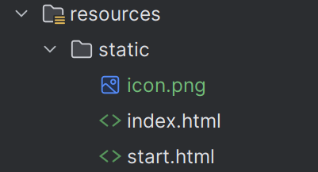
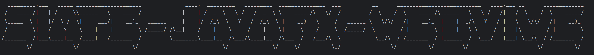

# 介绍

使用本包，可快速构建springboot+javaFX-webview的桌面端应用

# 使用教程

1. 下载此[maven包](https://github.com/naledao/simpleJavaFxWebView/releases/download/1.0.2/hhsc.zip)，解压，保存至自己的本地maven仓库

2. 在pom文件中导入依赖
   
   ```xml
   <dependency>
       <groupId>hhsc.kangnasi</groupId>
       <artifactId>simple-javafx-webview-spring-boot-starter</artifactId>
       <version>1.0.2</version>
   </dependency>
   ```

3. 在yml中添加配置
   
   ```yml
   hhsc:
     kangnasi:
       simple-javafx-webview:
   
         outer-spring-boot:
           class-path: kangnasi.xyz.simplejavafxwebviewtest.SimpleJavaFxWebViewTestApplication #你的项目的springboot启动类路径
   
         app:
           app-name: 测试 #应用的名字
           ico-path: http://127.0.0.1:9660/icon.png #应用的图标
           start-html-path: /static/start.html #应用的启动页面，用于在springboot启动前的过渡页面
           index-html-path: http://127.0.0.1:9660 #应用的主页面
           resizable: false # 是否可调整应用窗口大小，默认true
           width-scale: 0.6 #窗口默认宽度比例（与运行机器显示器宽度的比例），默认0.8
           height-scale: 0.6 #窗口默认长度比例（与运行机器显示器长度的比例），默认0.8
   
         system:
           memory-watch-duration: 30 #内存监控间隔，单位秒
           threshold-mb: 230 # 内存阈值，超过阈值会释放相关内存，默认值600
   ```
   
   resource目录可像下面这样，具体可自己定义
   
   
   4. 修改你自己的启动类，比如下面这样
   
   ```java
   @SpringBootApplication(
       exclude = SpringApplicationAdminJmxAutoConfiguration.class
   )
   public class SimpleJavaFxWebViewTestApplication {
   
       public static void main(String[] args) {
           Application.launch(JavaFXApplication.class);
       }
   }
   ```

4. 点击运行，你会出现如下的标识



# 应用场景

比如可嵌入vue的页面，页面与系统可通过本地的springboot使用平常的http请求来进行交互
