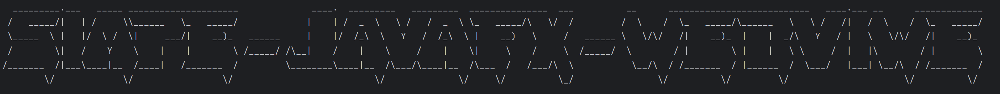

# 介绍

使用本包，可快速构建springboot+javaFX-webview的桌面端应用

# 使用教程

1. 下载此[maven包](https://github.com/naledao/simpleJavaFxWebView/releases/download/1.0.0/hhsc.zip)，解压，保存至自己的本地maven仓库

2. 在pom文件中导入依赖

   ```xml
   <dependency>
       <groupId>hhsc.kangnasi</groupId>
       <artifactId>simple-javafx-webview-spring-boot-starter</artifactId>
       <version>1.0.0</version>
   </dependency>
   ```

3. 在yml中添加配置

   ```yml
   hhsc:
     kangnasi:
       simple-javafx-webview:
         app-name: rabbitMqGUI # 窗口的名字
         spring-boot-class-path: kangnasi.xyz.simplejavafxwebviewtest.SimpleJavaFxWebViewTestApplication # 你的springboot启动类的包名
         index-html-path: http://127.0.0.1:9660/ # 主页面的地址
         ico-path: http://127.0.0.1:9660/ico.png # 程序的图标
         start-html-path: /static/start.html # 启动页面的地址，仅支持resource下的文件
   ```

4. 修改你自己的启动类，比如下面这样

   ```java
   @SpringBootApplication(
       exclude = SpringApplicationAdminJmxAutoConfiguration.class
   )
   public class SimpleJavaFxWebViewTestApplication {
   
       public static void main(String[] args) {
           Application.launch(JavaFXApplication.class);
       }
   }
   ```

5. 点击运行，你会出现如下的标识



# 应用场景

比如可嵌入vue的页面，页面与系统可通过本地的springboot使用平常的http请求来进行交互
